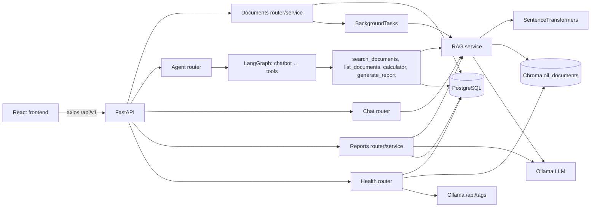

# Oil AI Agent

Oil AI Agent is a full-stack, retrieval-augmented question-answering system for PDF documents. Users upload PDFs through a React frontend, the FastAPI backend chunks and embeds them into a local Chroma vector store, and a LangGraph agent answers questions grounded in the retrieved document context using a locally hosted Ollama LLM.

## Overview

The main workflow is:

1. A user uploads a PDF on the Documents page.
2. The backend validates the file, stores it, and indexes it in the background (`uploaded` → `processing` → `indexed`, or `failed`).
3. Indexing splits the PDF text into overlapping chunks, generates sentence-transformer embeddings, and stores them in Chroma with document metadata.
4. The user asks a question on the Agent page. A LangGraph agent retrieves the most relevant chunks and produces an answer based only on that context, returning document sources with each answer.
5. The same retrieval pipeline powers one-shot chat (`/chat`) and persisted AI-generated reports (`/reports`).

## Key Features

- **PDF upload and background indexing** — multipart upload with content-type, emptiness, and 20 MB size validation; indexing runs as a FastAPI `BackgroundTask` with per-document status tracking.
- **RAG pipeline** — `RecursiveCharacterTextSplitter` chunking (1000 chars / 200 overlap), `all-MiniLM-L6-v2` embeddings, persistent Chroma collection (`oil_documents`), distance-thresholded retrieval (top 5, L2 ≤ 1.0).
- **LangGraph agent** — `chatbot ↔ tools` loop with `InMemorySaver` thread memory (`thread_id`), four bound tools, and a grounded-RAG fallback for models without tool-calling support.
- **Local LLM via Ollama** — `ChatOllama` configured centrally from `ollama_host` / `ollama_model` at temperature 0.
- **Source-grounded answers** — every RAG answer includes document name, page, and score; out-of-context questions get an explicit "not found" response instead of a hallucinated answer.
- **Report generation** — structured Markdown reports (summary, findings, analysis, recommendations, conclusion) generated from retrieved context and persisted in PostgreSQL.
- **REST API** — versioned (`/api/v1`) FastAPI routers with Pydantic validation and a uniform `APIResponse` envelope.
- **React frontend** — dashboard, documents, agent chat, reports, and settings pages with service/hook layers over axios.
- **System health checks** — liveness, database, and a `check-all` endpoint reporting per-component status (backend, database, Ollama, LLM model, vector store, RAG, agent, reports).
- **Centralized error handling** — domain exception (`OilAIAgentException`) mapped to structured JSON errors, including a 503 with diagnostics when Ollama is unreachable.
- **Regression tests** — 16 pytest tests covering validation, retrieval, agent fallback, and health endpoints.

## Architecture



- **Frontend** (`frontend/`) is a React + TypeScript + Vite SPA. It never talks to the database, Chroma, or Ollama directly; all data flows through the backend REST API.
- **Backend** (`backend/`) is a FastAPI app. Routers are thin; domain logic lives in per-feature services (`documents`, `reports`, `rag`, `agents`), with repository classes isolating SQLAlchemy access.
- **PostgreSQL** stores document metadata (filenames, size, status, timestamps) and generated reports. SQLAlchemy 2.0 + Alembic migrations.
- **Chroma** (persistent, local directory) stores chunk texts, embeddings, and metadata (`document_id`, `document_name`, `page`).
- **Ollama** (separate local server) serves chat completions; the backend reaches it over HTTP at the configured `ollama_host`.

## Tech Stack

| Layer | Technology | Purpose |
| ----- | ---------- | ------- |
| Frontend | React 19, TypeScript, Vite 8 | SPA UI, build tooling |
| Frontend | react-router-dom 7 | Client-side routing (dashboard, documents, agent, reports, settings) |
| Frontend | axios | HTTP client for `/api/v1` |
| Frontend | Tailwind CSS 4, shadcn/base-ui components, lucide-react | Styling and UI primitives |
| Frontend | recharts | Dashboard charts |
| Backend | FastAPI, uvicorn | REST API and ASGI server |
| Backend | Pydantic v2, pydantic-settings | Request validation and environment-based configuration |
| Database | PostgreSQL 16, SQLAlchemy 2.0, Alembic, psycopg2 | Relational storage and migrations |
| RAG | langchain-community `PyPDFLoader`, langchain-text-splitters | PDF text loading and chunking |
| RAG | sentence-transformers (`all-MiniLM-L6-v2`) | Local embedding model |
| RAG | ChromaDB (persistent client) | Vector store (`oil_documents` collection) |
| Agent/LLM | LangGraph, langchain-ollama `ChatOllama` | Tool-calling agent graph and Ollama chat integration |
| Tests | pytest | Backend regression suite |

## AI / RAG Pipeline

1. `POST /api/v1/documents/upload` receives a multipart PDF, rejects non-PDF/empty/>20 MB files, stores it under a UUID filename in `uploads/documents`, and creates a `documents` row with status `uploaded`.
2. A `BackgroundTasks` job (`DocumentProcessor.process_document`) flips the row to `processing`.
3. `RAGService.index_document` loads the PDF with `PyPDFLoader`, splits pages with `RecursiveCharacterTextSplitter` (chunk size 1000, overlap 200).
4. Each chunk is embedded with `all-MiniLM-L6-v2` (normalized) and added to the `oil_documents` Chroma collection with `document_id`, `document_name`, and `page` metadata.
5. On success the row becomes `indexed`; on any failure it becomes `failed` (re-indexable via `POST /api/v1/documents/{id}/reindex`, which deletes old vectors first).
6. A question embeds the query, fetches the top 5 chunks, and keeps those with L2 distance ≤ 1.0 (`DEFAULT_MAX_DISTANCE`, `DEFAULT_TOP_K` in `app/config/constants.py`).
7. With no chunks kept, the API returns "I couldn't find that information in the uploaded documents." without calling the LLM.
8. Otherwise the chunks are formatted into `RAG_PROMPT` (answer using only the context, never invent information) and sent to the configured Ollama model.
9. The response is returned with per-chunk sources: document name, page, and a 0–100 score derived from distance.

## Agent Architecture

- **State** (`app/agents/state.py`): `AgentState` extends LangGraph's `MessagesState` — the conversation is a message list, nothing else.
- **Graph** (`app/agents/graph.py`): `START → chatbot ⇄ tools`, compiled with `InMemorySaver`. The `chatbot` node invokes the tool-bound LLM; `tools_condition` routes tool calls to a `ToolNode`; tool results loop back to `chatbot`.
- **Tools** (`app/agents/tools/`): `search_documents` (RAG Q&A over uploads), `list_documents` (library listing from the database), `calculator` (restricted-expression evaluator), `generate_report` (petroleum maintenance report prompt via the LLM).
- **Threads**: `OilAIAgent.ask(question, thread_id)` generates a UUID when no `thread_id` is given; the checkpointer scopes history per thread, and `/agent/chat` echoes the `thread_id` back so the UI can continue the conversation.
- **Fallback**: if the configured model rejects tool calls (`does not support tools`, e.g. models without tool support), the agent logs a warning and answers through the grounded RAG path instead of failing — same retrieval, same model, with sources.
- **LLM wiring**: two `ChatOllama` instances (plain for RAG/reports, tool-bound for the agent) both built from the central `ollama_host` / `ollama_model` settings at temperature 0. (`app/llm/client.py` exists but is not used by any request path.)

## API

Base URL: `/api/v1`. Every success response uses the envelope `{success, message, data}`; domain errors use `{success: false, message, status_code}`.

| Method | Endpoint | Description |
| ------ | -------- | ----------- |
| GET | `/` | Welcome message (unversioned root) |
| GET | `/api/v1/health/` | Liveness: service name and version |
| GET | `/api/v1/health/database` | Real `SELECT 1` against PostgreSQL |
| GET | `/api/v1/health/check-all` | Per-component readiness: backend, database, Ollama, LLM model, vector store, RAG, agent, reports; overall `healthy`/`degraded` |
| GET | `/api/v1/health/error` | Diagnostic route that always raises the test error (HTTP 400) |
| POST | `/api/v1/documents/upload` | Multipart PDF upload; starts background indexing |
| GET | `/api/v1/documents` | List all documents with status |
| GET | `/api/v1/documents/{id}` | Get one document; 404 if missing |
| DELETE | `/api/v1/documents/{id}` | Delete file, vectors, and DB row; 404 if missing |
| POST | `/api/v1/documents/{id}/reindex` | Delete old vectors and rebuild the index |
| POST | `/api/v1/chat?question=...` | One-shot RAG answer (1–2000 chars, non-blank) |
| POST | `/api/v1/agent/chat` | Agent answer; body `{question, thread_id?}`; returns `{question, answer, sources, thread_id}`; 503 with diagnostics when Ollama is unreachable |
| POST | `/api/v1/reports/generate` | Body `{title (1–255), prompt (1–5000)}`; retrieves context, generates Markdown, persists it; 404 when nothing is indexed |
| GET | `/api/v1/reports` | List reports (id, title, created_at) |
| GET | `/api/v1/reports/{id}` | Full report including content; 404 if missing |
| DELETE | `/api/v1/reports/{id}` | Delete a report; 404 if missing |

Example — ask the agent:

```bash
curl -X POST http://localhost:8000/api/v1/agent/chat \
  -H 'Content-Type: application/json' \
  -d '{"question": "What are the main drilling challenges?"}'
```

```json
{
  "success": true,
  "message": "Agent response generated successfully.",
  "data": {
    "question": "What are the main drilling challenges?",
    "answer": "...grounded in the uploaded documents...",
    "sources": [{"document": "field-report.pdf", "page": 2, "score": 42.3}],
    "thread_id": "7f3a..."
  }
}
```

Example — system check (`GET /api/v1/health/check-all`, abbreviated):

```json
{
  "success": true,
  "data": {
    "status": "degraded",
    "checks": {
      "backend": {"status": "healthy", "detail": "Oil AI Agent API v1.0.0 responding"},
      "database": {"status": "healthy", "detail": "PostgreSQL reachable, SELECT 1 succeeded"},
      "ollama": {"status": "unhealthy", "detail": "Cannot connect to http://127.0.0.1:11434"},
      "llm": {"status": "unhealthy", "detail": "Cannot connect to http://127.0.0.1:11434", "model": "gemma3:4b"},
      "vector_store": {"status": "healthy", "detail": "Chroma collection accessible, 75 chunk(s)", "chunks": 75},
      "rag": {"status": "healthy", "detail": "Embeddings ready, 7 indexed document(s)", "indexed_documents": 7},
      "agent": {"status": "healthy", "detail": "Graph ready (4 tools, model gemma3:4b)", "tools": 4},
      "reports": {"status": "healthy", "detail": "Reports service ready, 0 report(s) stored", "reports": 0}
    }
  }
}
```

## Project Structure

```text
oil-ai-agent/
├── backend/
│   ├── main.py                  # FastAPI app, CORS, exception handler, root route
│   ├── requirements.txt         # Pinned Python dependencies
│   ├── Dockerfile               # python:3.13-slim image, uvicorn on :8000
│   ├── docker-compose.yml       # Local PostgreSQL 16 service
│   ├── alembic.ini / alembic/   # Migrations (documents + reports tables)
│   ├── app/
│   │   ├── agents/              # Router, OilAIAgent, LangGraph graph/state, tools/
│   │   │   └── tools/           # search_documents, list_documents, calculator, generate_report
│   │   ├── api/                 # health + chat routers, v1/ aggregator
│   │   ├── config/              # settings (pydantic-settings), constants, logging
│   │   ├── core/                # OilAIAgentException + JSON error handler
│   │   ├── database/            # engine/session, get_db dependency, Base
│   │   ├── documents/           # router, service (validation/storage/reindex), schema
│   │   ├── llm/                 # ChatOllama instances, RAG prompt
│   │   ├── models/              # Document model + status enum
│   │   ├── rag/                 # service, retriever, embeddings, vector store, processor
│   │   ├── reports/             # router, service, schema, model, repository, prompt
│   │   ├── repositories/        # document repository
│   │   ├── schemas/             # shared APIResponse envelope
│   │   └── services/            # health + system-check services
│   └── tests/
│       └── test_fixes.py        # 16 pytest regression tests
├── frontend/
│   ├── package.json             # React 19 + Vite 8 app, dev/build/lint/preview scripts
│   ├── vite.config.ts / tsconfig.* / index.html
│   └── src/
│       ├── api/                 # axios instance (VITE_API_URL, 30s timeout)
│       ├── services/            # agent, document, report, dashboard, settings API calls
│       ├── hooks/               # useAgent (threaded chat), useDocuments, useReports, useSettings, useDashboard
│       ├── pages/               # Dashboard, Documents, Agent, Reports, Settings
│       ├── routes/              # BrowserRouter + DashboardLayout routes
│       ├── components/          # agent, documents, dashboard, settings, layout, ui
│       └── lib/                 # shared utilities
├── requirements.txt             # Root Python dependency pins
└── README.md
```

Notes: `backend/app/pdf/`, `automation/`, `tools/`, `utils/`, `test_tools.py`, and `rag/test.py` exist but are not imported by any request path. `data/`, `docs/`, `scripts/`, `src/` at the repo root are empty. Runtime artifacts (`backend/uploads/`, `backend/storage/`, `backend/logs/`, `.env` files, `node_modules/`, `.venv/`) are git-ignored and intentionally absent from this tree.

## Installation

### Prerequisites

- Python 3.13 (see `backend/Dockerfile`)
- Node.js 20+ (required by Vite 8)
- Ollama running with a chat model pulled (the backend defaults to one model name; `OLLAMA_MODEL` must name a model actually present in Ollama)
- PostgreSQL 16 (or Docker, for the provided compose file)

### 1. Backend

```bash
cd backend
python -m venv .venv
source .venv/bin/activate        # Windows: .venv\Scripts\activate
pip install -r requirements.txt
```

Create `backend/.env` with these keys (`Settings` in `app/config/settings.py` provides code defaults for everything except `DATABASE_URL`):

```text
APP_NAME=...
APP_VERSION=...
DEBUG=...
HOST=...
PORT=...
FRONTEND_URL=http://<frontend-host>:<frontend-port>
DATABASE_URL=postgresql://<user>:<password>@<host>:5432/<db>
OLLAMA_HOST=http://<ollama-host>:11434
OLLAMA_MODEL=<model-name-pulled-in-ollama>
```

`DATABASE_URL` uses the standard SQLAlchemy PostgreSQL format — never commit real credentials.

### 2. Database

```bash
cd backend
docker compose up -d postgres   # starts PostgreSQL 16 on port 5432 with a persisted volume
alembic upgrade head            # creates the documents and reports tables
```

`alembic.ini` holds the migration connection URL; point it at the same database as `DATABASE_URL`.

### 3. Frontend

```bash
cd frontend
npm install
```

Create `frontend/.env` pointing at the backend API (host, port, and `/api/v1` prefix must match your backend setup):

```text
VITE_API_URL=http://<backend-host>:<backend-port>/api/v1
```

### 4. Ollama / local LLM

1. Install Ollama from the official site and start it (`ollama serve`).
2. Pull the model named in `OLLAMA_MODEL`, e.g. `ollama pull <model>`, and confirm it with `ollama list`.
3. The backend connects over HTTP to `OLLAMA_HOST` (default `http://localhost:11434`) using `langchain-ollama`; no API keys are needed.
4. Networking note: the backend must be able to route to `OLLAMA_HOST`. If the backend runs somewhere `localhost` does not resolve to the Ollama machine (e.g. backend in WSL while Ollama runs on the Windows host), set `OLLAMA_HOST` to an address that actually reaches the Ollama server.
5. The first embedding call downloads the `all-MiniLM-L6-v2` sentence-transformer weights from Hugging Face, so the backend host needs internet access on first run.

## Running the Project

### Backend

```bash
cd backend
../.venv/bin/python -m uvicorn main:app --host 127.0.0.1 --port 8000
```

Health: `curl http://127.0.0.1:8000/api/v1/health/` · Full readiness: `curl http://127.0.0.1:8000/api/v1/health/check-all` · Interactive docs: `http://127.0.0.1:8000/docs`.

Or via Docker (uses `backend/Dockerfile`, serves on port 8000):

```bash
cd backend
docker build -t oil-ai-backend .
docker run -p 8000:8000 --env-file .env oil-ai-backend
```

### Frontend

```bash
cd frontend
npm run dev        # Vite dev server (http://localhost:5173 by default)
npm run build      # type-check + production build
npm run preview    # preview the production build
npm run lint       # oxlint
```

### Database / Docker

```bash
cd backend
docker compose up -d postgres
docker compose down
```

## Testing

- Framework: **pytest**, suite lives in `backend/tests/test_fixes.py` — **16 tests, all passing** (verified by running `pytest tests/ -q` from `backend/`).
- The suite is self-contained: heavy dependencies (Ollama, Postgres, Chroma) are mocked, so it runs without any services up.
- Covered: document validation (non-PDF rejected, field limits), empty-collection retrieval, distance-threshold filtering, report 404 on empty index, agent fallback when the model rejects tools, error re-raising, structured 503 on Ollama connection failure, single health route, and the full `check-all` contract (all 8 components, healthy-with-mocked-Ollama, graceful DB-outage degradation).
- No frontend test runner is configured (`dev`/`build`/`lint`/`preview` only); frontend verification is via `tsc -b` (part of `npm run build`) and `oxlint`.

## Example Usage

1. Open the frontend (`/documents`) and upload a PDF (PDF only, ≤ 20 MB). The API responds immediately with status `uploaded`.
2. Poll `GET /api/v1/documents` (or watch the UI) until the status becomes `indexed` — background chunking/embedding is done. If it shows `failed`, call `POST /api/v1/documents/{id}/reindex`.
3. Open `/agent` and ask, e.g. `{"question": "What are the main drilling challenges?"}` to `POST /api/v1/agent/chat`. Keep the returned `thread_id` for follow-ups in the same conversation.
4. The answer arrives with `sources` (`document`, `page`, `score`). Ask something absent from the PDFs to see the explicit not-found response.
5. On `/reports`, submit a title + prompt to `POST /api/v1/reports/generate` to persist a Markdown report built from retrieved context, then view or delete it from the list.

## Error Handling and Reliability

- Pydantic validation on inputs: report title/prompt lengths, chat question length (1–2000, blank rejected), upload content-type/emptiness/size.
- `OilAIAgentException` → structured `{success: false, message, status_code}` JSON (400/404/503 shapes); 404s for missing documents/reports and empty report indexes.
- Ollama connection failures on `/agent/chat` become HTTP 503 naming the configured host (full traceback retained in server logs), instead of an empty 500.
- Empty retrieval short-circuits before any LLM call, returning the not-found message with empty sources.
- Models without tool-calling support trigger a logged, grounded-RAG fallback (retrieval + same LLM + sources) rather than a failed agent run; unrelated agent errors still propagate.
- `check-all` isolates every probe with try/except plus session rollbacks, so one broken component reports `unhealthy` with a reason while the rest still report, and the overall status becomes `degraded`.
- Upload/index failures mark documents `failed` (never silently dropped) and are retryable via reindex; deleting a document also removes its file and vectors.

## Security Notes

- **No authentication or authorization is implemented** — `app/api/auth.py` is an empty stub and no route requires credentials. Do not expose this deployment to untrusted networks.
- Secrets belong in environment files: `DATABASE_URL` and any future keys must stay in untracked `.env` files (already git-ignored), never in code or commits.
- Uploads are restricted by content type (`application/pdf`), non-empty content, and a 20 MB cap; stored filenames are UUIDs, though original filenames are persisted as provided.
- CORS allows only the configured `FRONTEND_URL` origin (development default `http://localhost:5173`).
- The agent's `calculator` tool evaluates expressions with `eval` under restricted globals — treat it as untrusted-input surface if hardening the deployment.
- `GET /api/v1/health/error` is a diagnostic route that always raises; remove or protect it before any public deployment.

## Current Limitations

- No authentication, no rate limiting, no pagination — list endpoints return full tables, so very large libraries will be slow.
- Requires local services: PostgreSQL, Ollama with a pulled model, and (first run) Hugging Face access for embedding weights.
- Agent conversation memory is in-process (`InMemorySaver`); threads are lost on backend restart.
- `Settings.debug` defaults to `True`; logging is plain text to `logs/app.log` plus stdout, with no rotation or request tracing.
- PDF-only ingestion validated by client-supplied content type; scanned/image-only PDFs yield little or no extractable text.
- Root `docker-compose.yml` is empty — only `backend/docker-compose.yml` (PostgreSQL) is usable; there is no compose setup for the API, frontend, or Ollama.
- Some shipped modules are unused dead code (`app/pdf/*`, `app/llm/client.py`, `TextChunker`, `test_tools.py`/`rag/test.py` scratch scripts).

## Future Improvements

Small, realistic next steps building on the current design (not implemented):

- Token-based auth and per-user document isolation.
- Paginated, filterable document/report listings.
- Persistent agent memory (e.g. Postgres checkpointer) instead of in-memory threads.
- Streaming agent responses (SSE/WebSocket) for long answers.
- A `docker-compose` setup covering API, frontend, and Ollama profiles, plus a committed `.env.example`.
- Frontend test setup (Vitest + Testing Library) and CI running pytest + build + lint.
- Structured/JSON logging with rotation and a request ID.

## License

No license file is present in the repository.
